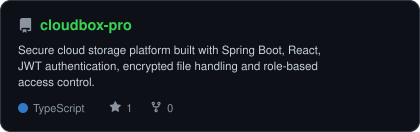
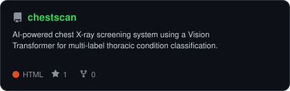
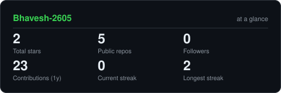

<h1>Hi 👋, I'm Bhavesh V</h1>

<h3>
Java Full Stack Developer | Backend Developer | CSE @ SSN
</h3>

  

  

  

  

---

## 👨‍💻 About Me

I'm **Bhavesh V**, a Computer Science undergraduate focused on backend development and AI-powered systems.

* 🔭 Building projects in **Java, Spring Boot, AI and RAG**
* ⚙️ Working with **Spring Boot, SQL, Docker and REST APIs**
* 🧠 Exploring **LLMs, vector databases and retrieval systems**
* 🎯 Preparing for **Backend Developer and Software Development Engineer roles**

---

## 🛠️ Toolbox

  

---

## 🧠 Engineering Profile

<table>
<tr>

<td width="50%" align="center">

### Skill Radar

<picture>
  <source media="(prefers-color-scheme: dark)" srcset="assets/radar-dark.svg">
  <source media="(prefers-color-scheme: light)" srcset="assets/radar-light.svg">
  
</picture>

</td>

<td width="50%" align="center">

### Repository Languages

<picture>
  <source media="(prefers-color-scheme: dark)" srcset="assets/radar-langs-dark.svg">
  <source media="(prefers-color-scheme: light)" srcset="assets/radar-langs-light.svg">
  
</picture>

</td>

</tr>
</table>

---

## 🚀 Featured Projects

<table>
<tr>

<td width="50%" align="center">

<a href="https://github.com/Bhavesh-2605/cloudbox-pro">
<picture>
  <source media="(prefers-color-scheme: dark)" srcset="assets/card-cloudbox-pro-dark.svg">
  <source media="(prefers-color-scheme: light)" srcset="assets/card-cloudbox-pro-light.svg">
  
</picture>
</a>

</td>

<td width="50%" align="center">

<a href="https://github.com/Bhavesh-2605/chestscan">
<picture>
  <source media="(prefers-color-scheme: dark)" srcset="assets/card-chestscan-dark.svg">
  <source media="(prefers-color-scheme: light)" srcset="assets/card-chestscan-light.svg">
  
</picture>
</a>

</td>

</tr>
</table>

---

## 📊 GitHub Statistics

<picture>
  <source media="(prefers-color-scheme: dark)" srcset="assets/card-stats-dark.svg">
  <source media="(prefers-color-scheme: light)" srcset="assets/card-stats-light.svg">
  
</picture>

---

## 🎯 Currently

* Improving **DSA and SQL**
* Learning **System Design and Docker**
* Building **backend and AI projects**
* Exploring **RAG, LLMs and vector databases**

---

## 🤝 Let's Connect

---

  <b>Building scalable systems, learning deeply, and improving one project at a time.</b>

